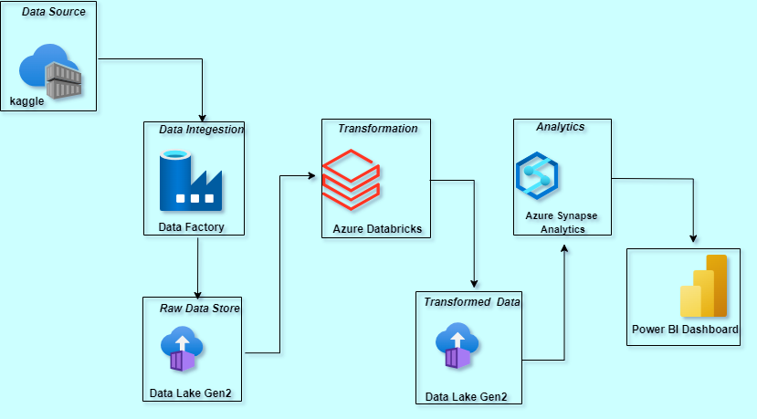
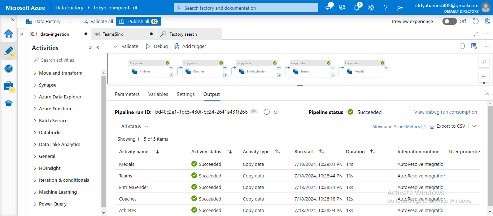
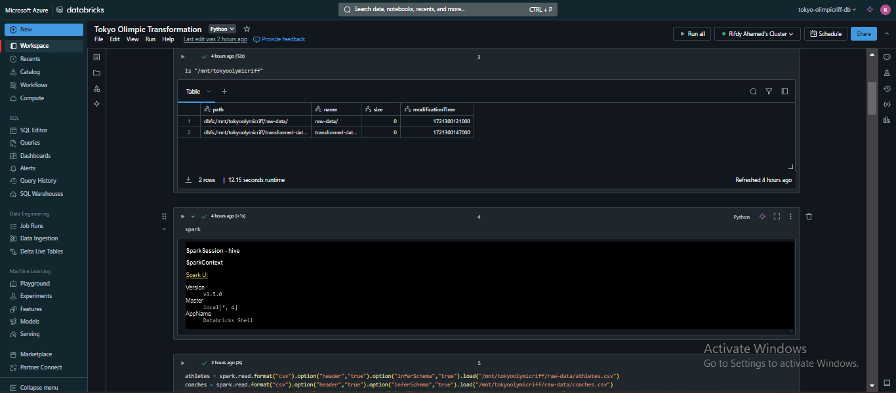
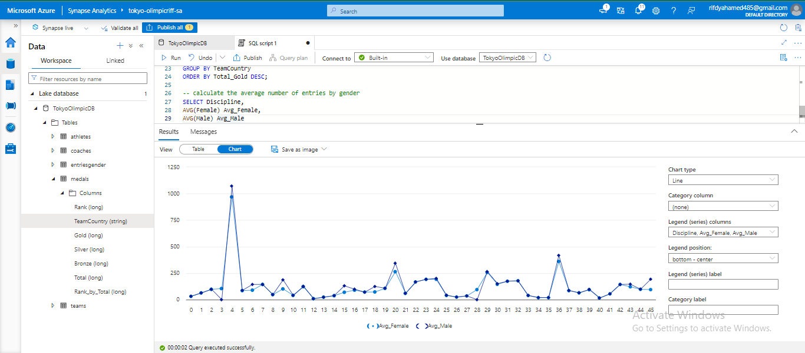
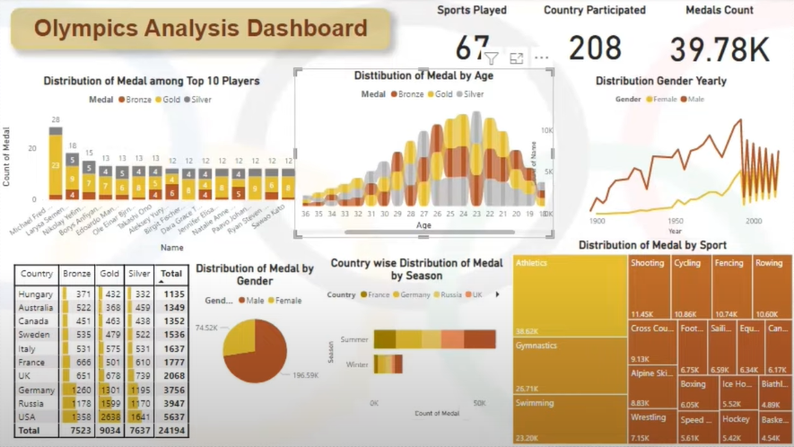

# Olympic Data Analytics | Azure End-To-End Data Engineering Project

## Introduction

To gain hands-on experience with Microsoft Azure's cloud services by analyzing and extracting insights from the Tokyo Olympics dataset. The project aimed to leverage various Azure services to implement a full-scale data analytics pipeline, from data ingestion to visualization.

## Architecture

### Data Acquisition

I obtained datasets from Kaggle 📈 and implemented data integration pipelines using Azure Data Factory 🔄 to facilitate efficient data movement and transformation (ETL) between various sources and destinations within Azure and beyond.

#### Data Integration & ETL Process

Azure Data Factory (ADF)

Purpose: Implemented for orchestrating data pipelines that manage the movement and transformation of data across different platforms.

Process: Set up and automated data pipelines that handled Extract, Transform, Load (ETL) processes, ensuring efficient data integration
between various sources (e.g., Azure Blob Storage, on-premises databases) and destinations (e.g., Azure Data Lake, Azure SQL Database).

Outcomes: Facilitated seamless data flow, ensuring that data from the Tokyo Olympics was accurately transformed and stored for further processing.

#### Data Storage

Azure Data Lake Storage Gen2

Purpose: Used for storing the large datasets securely while enabling high-performance analytics.

Features: Leveraged its hierarchical namespace to organize data and utilized advanced security features like Azure Active Directory integration for access control.

Outcomes: Provided a scalable and cost-effective solution for managing the vast amount of data involved in the project.

### Data Processing & Analytics

Azure Databricks

Purpose: Conducted large-scale data processing using Apache Spark to explore and analyze the Tokyo Olympics data.

Process: Utilized PySpark for distributed data processing, handling tasks such as data cleaning, exploratory data analysis (EDA), and feature engineering.

Collaboration: Azure Databricks' collaborative workspace was used to work with notebooks and integrate with other Azure services, promoting teamwork and efficient workflow management.

Outcomes: Enabled the processing of large datasets efficiently and provided insights such as medal distributions, performance trends, and athlete demographics.

### Data Warehousing & Advanced Analytics

Azure Synapse Analytics

Purpose: Integrated data warehousing capabilities with big data analytics, enabling complex queries and real-time analytics.

Process: Data from the Azure Data Lake was loaded into Synapse, where SQL-based queries were used to perform advanced analytics, including time-series analysis and predictive modeling.

Outcomes: Created a unified platform that allowed for in-depth analysis and reporting, supporting both structured and unstructured data.

### Data Visualization & Reporting

Microsoft Power BI

Purpose: Developed interactive dashboards and reports to visualize key insights derived from the Tokyo Olympics data.

Process: Connected Power BI to the Synapse Analytics workspace, allowing for real-time data visualization and dynamic reporting features such as drill-downs and filters.

Outcome: Delivered intuitive and actionable reports, making it easy for stakeholders to understand trends, patterns, and performance metrics of the Tokyo Olympics.

* Skills & Technologies Used:
    * Cloud Services: Microsoft Azure (Data Factory, Data Lake Storage Gen2, Databricks, Synapse Analytics)
    * Programming & Data Processing: Python, PySpark, SQL
    * Data Visualization: Microsoft Power BI

